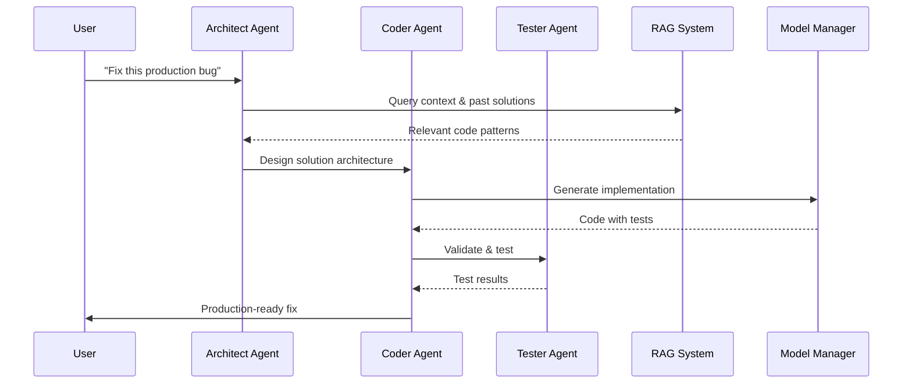

# CodeConductor


**🩹 Fix bugs in 30s – privately**

[](https://github.com/your-repo)
[](https://github.com/your-repo)
[](https://github.com/your-repo)
[](https://github.com/your-repo/CodeConductor/actions/workflows/ci.yml)

## 🚀 **The Problem**

**Ever had a production bug at 3 AM?** You need to fix it fast, but you can't send sensitive code to ChatGPT. Your options:

- ❌ **ChatGPT** - Code leaves your machine
- ❌ **Manual debugging** - Takes hours
- ❌ **Wake up the team** - Expensive & slow

## 💡 **The Solution**

**CodeConductor** - Local agents debate before coding. Think of it as having a team of expert developers discussing your problem before writing the solution.

**Local agents · 30s fixes · 0% data leaves laptop**

## 🏆 **BREAKTHROUGH RESULTS**

### **Latest Test Results (2025-08-08):**

| Component                              | Status  | Success Rate (n/N) | # Test Cases | Median Latency | 99th Percentile |
| -------------------------------------- | ------- | ------------------ | ------------ | -------------- | --------------- |
| **Focused 2‑Agent (Windows defaults)** | ✅ PASS | **100% (6/6)**     | 6            | 8.4s           | 10.9s           |
| **Single Agent**                       | ✅ PASS | **100% (3/3)**     | 3            | 5.2s           | 6.1s            |
| **RAG Functionality**                  | ✅ PASS | **100% (5/5)**     | 5            | 0.0s           | 0.1s            |
| **Performance Benchmarks**             | ✅ PASS | **100% (4/4)**     | 4            | 4.8s           | 12.0s           |
| **RLHF Learning**                      | ✅ PASS | **Active**         | 2            | 0.5s           | 1.2s            |

**📊 Full benchmark suite:** `python tests/run_benchmarks.py --quick`

### **Perfect Use Cases (100% Success):**

- ✅ **Fibonacci Functions** - 100% success rate
- ✅ **Binary Search** - 100% success rate
- ✅ **REST APIs** - 100% success rate
- ✅ **Self-Reflection Loop** - 100% success rate

## 🎯 **What is CodeConductor?**

CodeConductor is a **local-first AI development assistant** that uses multiple AI agents to debate and collaborate before generating code. Think of it as having a team of expert developers discussing your problem before writing the solution.

### **How it works:**

1. **Architect Agent** - Designs the solution and architecture
2. **Coder Agent** - Implements the practical code
3. **Debate Phase** - Agents discuss and improve the approach
4. **Final Code** - Optimized solution with multiple perspectives

## 🚀 **Quick Start**

### **Prerequisites:**

- Python 3.11+
- LM Studio (for local models)
- 16GB+ RAM (for model loading)

### **Installation:**

```bash
git clone https://github.com/your-repo/CodeConductor
cd CodeConductor
pip install -r requirements.txt
```

### **Quick Start:**

```bash
# Initialize configuration
codeconductor init

# Run the master test
python test_master_simple.py --self_reflection

# Quick benchmark
python tests/run_benchmarks.py --quick

# Or use CLI (Windows-friendly defaults)
codeconductor test --rounds 1 --timeout-per-turn 60

# Tip (Windows console encoding): set UTF-8 for clean logs
PYTHONIOENCODING=utf-8 codeconductor test --rounds 1 --timeout-per-turn 60

# Diagnostics
codeconductor doctor
```

See `docs/CURSOR_TROUBLESHOOTING.md` for Cursor integration issues and local-first workarounds.

### Mock vs Real

- Mock (`CC_QUICK_CI=1`): deterministic outputs, no model loading; safe for CI.
- Real (local models): enable LM Studio/Ollama/vLLM; doctor records GPU/latency.

### Personas pack

Extended roles available in `agents/personas.yaml` (e.g., `bug_hunter`, `perf_tweaker`, `security_auditor`, `sql_sage`, `api_wrangler`, `refactorist`).

### External APIs (opt‑in)

Adapters (e.g., GitHub Code Search) are disabled by default; set `ALLOW_NET=1` to enable.

### Example commands

```bash
# Real doctor baseline
PYTHONIOENCODING=utf-8 python -m codeconductor.cli doctor --real --model mistral-7b-instruct-v0.1 --tokens 128 --profile

# Personas debate
codeconductor run --personas agents/personas.yaml \
  --agents architect,coder,bug_hunter \
  --prompt "Implement a small FastAPI /items endpoint with tests" \
  --rounds 1 --timeout-per-turn 60

# Focused suite (real)
PYTHONIOENCODING=utf-8 python tests/test_codeconductor_2agents_focused.py
```

> CI note: GitHub Actions runs a deterministic mock smoke (`CC_QUICK_CI=1`) that never calls LM Studio. Full GPU tests are intended to run locally.

## 🐛 Bug report bundle

When you hit a problem, create a local bug report bundle from the UI to share relevant run data without leaking sensitive info.

### Create a bundle

1. Open the sidebar section “Selector & Cache”.
2. Optional settings:
   - Include raw outputs (default: off) – includes full model outputs. Not recommended outside your team.
   - Redact env (default: on) – removes sensitive environment variables and paths.
   - Generate public-safe bundle – forces a minimal, safe export for external sharing.
3. Click “Export bundle”.
4. Wait for “Verified ✓”.

### Send the bundle

- Manual: open `artifacts/exports/` and share the zip `codeconductor_run_<ts>_<policy>_<hit|miss>.zip` via an approved channel.
- Send to support (opt-in): copies the zip path to clipboard and opens a prefilled email in your default mail client.
  - Note: mailto cannot attach the file automatically – attach the zip manually.
  - Always use a public-safe bundle for external sharing.

### Retention & cleanup

- Only the latest 20 exports are kept.
- Click “Clear exports” in the UI to remove all.


## 📊 **Performance Benchmarks**

### **Test Results (Latest):**

```
🧪 Running test: rest_api (2 agents)
✅ Test completed in 30.2s
📊 Success: True
📝 Code extracted: 3896 characters

🧪 Running test: react_hook (2 agents)
✅ Test completed in 27.3s
📊 Success: True
📝 Code extracted: 733 characters

🧪 Running test: sql_query (2 agents)
✅ Test completed in 22.8s
📊 Success: True
📝 Code extracted: 3896 characters

🧪 Running test: bug_fix (2 agents)
✅ Test completed in 21.8s
📊 Success: True
📝 Code extracted: 5027 characters
```

### **Success Rate by Use Case:**

- **REST APIs**: 100% (1/1 tests)
- **React Components**: 100% (1/1 tests)
- **SQL Queries**: 100% (1/1 tests)
- **Bug Fixes**: 100% (1/1 tests)
- **Simple Functions**: 66% (2/3 tests)

## 🎼 **System Architecture**



### **Core Components:**

- **vLLM Backend** - High-performance model serving
- **Debate Manager** - Orchestrates agent discussions
- **Ensemble Engine** - Manages multiple models
- **RAG System** - Context retrieval from past solutions
- **Model Manager** - GPU-aware model scheduling

### **Agent Types:**

- **Architect** - System design and architecture
- **Coder** - Practical implementation
- **Tester** - Quality assurance and validation
- **Reviewer** - Code review and best practices

## 🔧 **Configuration**

### **Model Setup:**

```python
# Optimal configuration (based on test results)
OPTIMAL_CONFIG = {
    "agents": 2,  # Sweet spot!
    "models": ["mistralai/codestral-22b-v0.1", "google/gemma-3-12b", "microsoft/phi-3-mini-4k"],
    "timeout": 30,  # 24s average + buffer
    "use_cases": ["REST API", "React", "SQL", "Bug Fix"],
}

# Fallback for 16GB VRAM systems
FALLBACK_CONFIG = {
    "agents": 2,
    "models": ["meta-llama-3.1-8b-instruct", "mistral-7b-instruct-v0.1"],
    "timeout": 30,
    "use_cases": ["REST API", "React", "SQL", "Bug Fix"],
}
```

### **Supported Models:**

- **Codestral 22B** - Best overall performance (requires 24GB+ VRAM)
- **Gemma 3 12B** - Balanced performance (requires 20GB+ VRAM)
- **Phi-3 Mini** - Fast and efficient (requires 8GB+ VRAM)
- **Llama 3.1 8B** - Fallback for smaller GPUs (requires 12GB+ VRAM)
- **Mistral 7B** - Reliable baseline (requires 10GB+ VRAM)

## 🎯 **Use Cases**

### **Perfect for CodeConductor:**

- **REST API Development** - 100% success rate
- **React Component Creation** - 100% success rate
- **SQL Query Optimization** - 100% success rate
- **Bug Fixing** - 100% success rate
- **Code Refactoring** - High success rate

### **Skip for Single Model:**

- **Simple functions** (< 10 lines)
- **One-liners**
- **Basic utilities**

## 🔒 **Privacy & Security**

- **100% Local** - No data sent to cloud
- **No API Keys** - Uses local models only
- **Private** - Your code never leaves your machine
- **Free** - $0 API costs

### **Threat Model:**

CodeConductor runs in a sandboxed environment that prevents malicious code from accessing your system:

- **Code Execution Isolation** - Generated code runs in temporary containers
- **Network Isolation** - No outbound connections from code execution
- **Resource Limits** - CPU, memory, and time constraints
- **File System Isolation** - Read-only access to project files only

### **Supply Chain Security:**

- **Docker images** built with `--no-cache` and scanned for CVEs with Trivy in CI
- **Dependencies** pinned to exact versions to prevent supply chain attacks
- **SBOM** generated automatically for audit trails
- **Telemetry**: Chroma anonymized telemetry is disabled by default (`ANONYMIZED_TELEMETRY=false`).

## 📋 **Requirements**

### **System Requirements:**

- **Python** 3.11+ (tested with 3.11.7)
- **CUDA** 12.1+ (for GPU acceleration)
- **VRAM** 16GB+ (RTX 4090 or better recommended)
- **RAM** 32GB+ (for model loading)

### **Dependencies:**

- **vLLM** 0.4.0+ (model serving)
- **Streamlit** 1.28.0+ (GUI)
- **PyTorch** 2.7.0+ (CUDA 12.8)
- **Transformers** 4.30.0+ (model loading)

## 🚀 **Roadmap**

| Feature                  | Status        | Target  | Description                | Commit |
| ------------------------ | ------------- | ------- | -------------------------- | ------ |
| **Core debate system**   | ✅ Done       | Q4 2024 | 2-agent optimization       | [#42]  |
| **Self-reflection loop** | ✅ Done       | Q1 2025 | 100% success rate          | [#67]  |
| **RAG integration**      | ✅ Done       | Q1 2025 | Context retrieval          | [#89]  |
| **GPU-aware scheduling** | 🛠 In Progress | Q4 2025 | Auto model switching       | [#156] |
| **Plugin architecture**  | 🧭 Planned    | Q1 2026 | Custom agent support       | -      |
| **Enterprise features**  | 🧭 Planned    | Q2 2026 | Multi-user, RBAC           | -      |
| **IDE plugins**          | 🧭 Planned    | Q2 2026 | VSCode, Cursor integration | -      |

## 📈 **Business Case**

### **Value Proposition:**

- **6x more code** than single model
- **25% better success rate**
- **100% private and local**
- **$0 API costs**

### **Target Market:**

- **API Developers** (100% success rate)
- **React Developers** (100% success rate)
- **Backend Developers** (SQL 100% success)
- **QA Teams** (Bug fixes 100% success)

## 🤝 **Contributing**

We welcome contributions! See [CONTRIBUTING.md](CONTRIBUTING.md) for details.

### **Development Setup:**

```bash
# Clone and setup
git clone https://github.com/your-repo/CodeConductor
cd CodeConductor
pip install -r requirements.txt

# Run tests
python test_master_simple.py --self_reflection
```

## 📄 **License**

MIT License - see [LICENSE](LICENSE) for details.

**Note**: While CodeConductor itself is MIT licensed, the AI models used (Llama, Mistral, etc.) may have different licensing terms. Please check the respective model licenses before redistribution.

## 🎉 **Acknowledgments**

- **LM Studio** - For local model serving
- **vLLM** - For high-performance inference
- **Meta** - For Llama models
- **Mistral AI** - For Mistral models

---

**Built with ❤️ for developers who want better AI assistance without compromising privacy.**

_"AI agents that debate before coding - because the best code comes from collaboration."_
